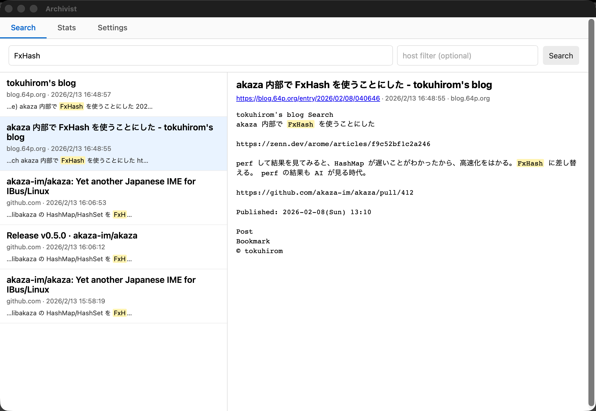

# Archivist



Archivist is a **local-first personal web archive**.

It automatically captures the pages you read in Chrome (title + canonicalized URL + visible text) and stores them locally in SQLite (FTS5), so you can search everything later from a menu-bar app.

> Privacy note: Archivist is designed to be local-first. The Chrome extension only *sends* captured text to your local app. The app never sends your stored content back to the extension.

---

## Features

- **Automatic capture** after a page finishes loading (with a small delay)
- **Local SQLite + FTS5** full-text search with trigram tokenizer (Japanese-friendly)
- **Two-pane search UI** with favicon display, keyword highlighting, and keyboard navigation (Arrow Up/Down)
- **Menu-bar (system tray) resident** — closing the window keeps the ingest server running in the background
- **Launch at login** — optional auto-start via macOS LaunchAgent (toggle in Settings)
- **Domain stats & global stats** (page count, total chars/bytes, domain breakdown)
- **Content extraction** via Readability.js for cleaner text capture
- **No "content return path"** from the app to the extension (one-way ingest)

---

## Repository layout

```
apps/archivist-tauri/       Tauri desktop app (macOS)
  src/                      Frontend (vanilla TypeScript + Vite)
  src-tauri/                Rust backend (Axum HTTP server + SQLite + Tauri commands)
extensions/chrome/          Chrome MV3 extension
```

---

## Requirements (macOS)

- Node.js 22+
- Rust toolchain (stable)
- Tauri prerequisites for macOS (Xcode command line tools)

---

## Quick start

### 1) Start the desktop app

```bash
make setup   # install frontend dependencies
make dev     # start in development mode (Vite + Tauri hot reload)
```

Or equivalently:

```bash
cd apps/archivist-tauri
npm install
npm run tauri dev
```

On first launch, Archivist generates a local ingest token and shows it in **Settings**.

By default, the app listens on `http://127.0.0.1:17373`.

### 2) Install the Chrome extension

1. Open `chrome://extensions`
2. Enable **Developer mode**
3. Click **Load unpacked**
4. Select `extensions/chrome`

Then open the extension **Options** page and set:

- `Ingest URL`: `http://127.0.0.1:17373/capture`
- `Token`: copy from the Archivist app Settings

### 3) Build for production

```bash
make build   # creates .app bundle in src-tauri/target/release/bundle/macos/
```

---

## How capture works

1. Chrome detects `tab.status == "complete"`
2. Waits a short delay (default: 2000ms)
3. Extracts title, canonical URL, and visible text (via Readability.js)
4. Normalizes the URL (drops fragments + common tracking params)
5. Deduplicates via in-memory SHA-1 cache (10-min throttle)
6. Sends JSON to the app over `127.0.0.1` with `Authorization: Bearer <token>`

---

## Database schema

Archivist uses SQLite with FTS5 (trigram tokenizer) and a `pages` table for metadata.

See: `apps/archivist-tauri/src-tauri/sql/schema.sql`

---

## Security model (practical)

- The ingest server only listens on `127.0.0.1`
- Requests require a random token (Bearer auth)
- The extension does not receive stored content back from the app

This is intended to be "reasonable for personal use" rather than "high assurance".

---

## Make targets

| Target | Description |
|--------|-------------|
| `make setup` | Install frontend dependencies |
| `make dev` | Start in development mode |
| `make build` | Production build (macOS .app bundle) |
| `make lint` | Run `cargo clippy` on the Rust backend |
| `make clean` | Remove build artifacts |

---

## Architecture notes

### Why rusqlite instead of tauri-plugin-sql?

Tauri has an official `tauri-plugin-sql` for SQLite access, but Archivist uses `rusqlite` directly because:

- The app runs an **Axum HTTP server** (`127.0.0.1:17373`) to receive page captures from the Chrome extension. This server needs Rust-side DB access, which `tauri-plugin-sql` does not expose.
- Using a single `Arc<Mutex<Connection>>` shared between Tauri commands (reads) and Axum handlers (writes) keeps the architecture simple.

### System tray

The app stays resident in the macOS menu bar. Closing the window hides it rather than quitting, so the HTTP ingest server remains available for the Chrome extension. Use the tray icon to show/hide the window, or **Quit** from the tray menu.

---

## License

MIT.
